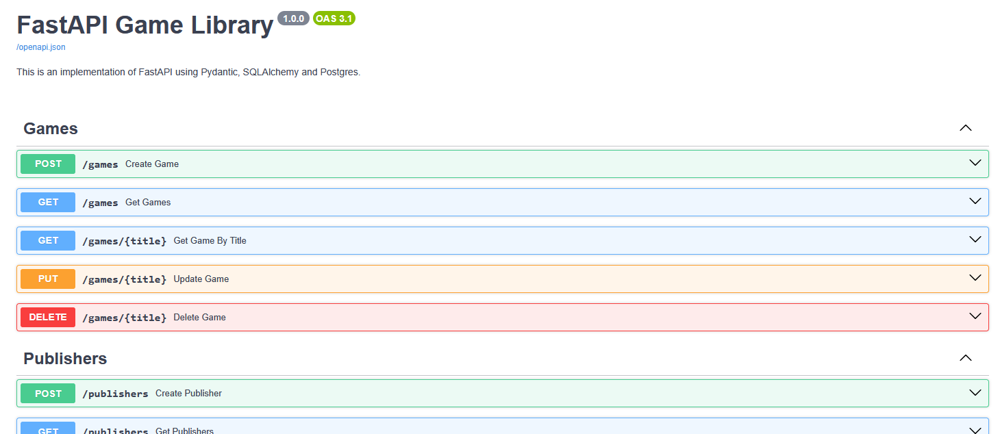
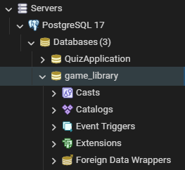

# FastAPI Game Library

A slightly more complex implementation of FastAPI, using SQLAlchemy to connect it to a Postgres database.



# Project setup

I've included 2 options for recreating the project: running in a docker container, and running yourself on your machine. The docker setup only requires that you have docker, while the locally hosted option requires a bit more work.

## Option 1: Run with Docker (preferred)

### Prerequisites:
* [Docker](https://www.docker.com/)

### Clone the Rpository

```bash
git clone https://github.com/Jacob-Armstrong/FastAPI-Game-Library
cd FastAPI-Game-Library
```

### Run the container with Docker
```bash
docker-compose up -d
```
Once both containers have started up, you will be able to access the [documentation](#access-the-api-documentation) or make requests yourself!

## Option 2: Host it yourself

### Prerequisites:
* [Python 3.13](https://www.python.org/downloads/release/python-3130/)
* [uv](https://github.com/astral-sh/uv)
* [Postgres](https://www.postgresql.org/)

### Clone the repository
```
git clone https://github.com/Jacob-Armstrong/FastAPI-Game-Library
cd FastAPI-Game-Library
```

### Install dependencies
```
uv venv
.\.venv\Scripts\activate
uv pip install -r requirements.txt
```

### Set up the database

The expected database name is `game_library`, and the expected username:password is `postgres:pass` but you are welcome to change the connection in `database.py`.



### Run the FastAPI Server
```
fastapi run
```

# Access the API Documentation
Once the server is running, you can access the built in documentation at:
* Swagger UI: http://127.0.0.1:8000/docs
* ReDoc: https://127.0.0.1:8000/redoc

You can also make calls with your own preference of API clients. I've included the suite of test calls I personally used while developing this in `yaak.fastapi-game-library.json` via [yaak](https://yaak.app/).